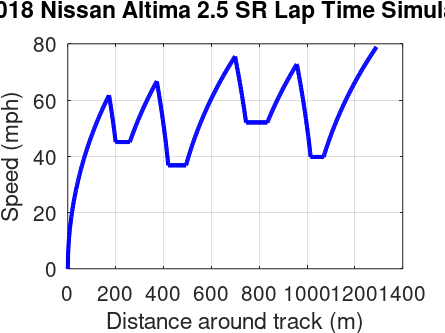

# nissan-altima-laptime-simulator
A point-mass vehicle dynamics and lap time simulation script for a 2018 Nissan Altima 2.5 SR using a two-pass integration method in MATLAB/Octave.

## 🚗 Car Stats I Used
I found some approximate specs for my Altima online to plug into the physics equations:
* **Mass ($m$):** 1470 kg (~3240 lbs)
* **Horsepower ($hp$):** 179 hp (multiplied by 745.7 in the code to get Watts)
* **Aerodynamics:** Drag coefficient ($C_d$) of 0.29 and frontal area ($A$) of 2.25 $m^2$
* **Tire Friction ($\mu$):** 0.92 (standard street tires)
* **Grip Limits:** Max driving force is capped at 3600 N to keep the tires from spinning. Braking force is a constant 9000 N.

## 🏁 Track Layout & How the Code Works
The track is 1,435 meters long. I set it up by combining straight sections (`inf` radius) with different corners down to a sharp 30-meter turn. 

The integration logic uses a basic Euler-Cromer approach over small distance steps ($ds = 1\text{ meter}$):
1. **Forward Pass (Gas):** The script starts from zero speed and calculates engine force based on available power ($F = P/v$), subtracting aerodynamic drag and rolling resistance to find acceleration via $F=ma$.
2. **Corner Speed Capping:** The code checks if the car is in a turn and limits the top speed using the lateral grip formula $v_{limit} = \sqrt{\mu g r}$.
3. **Backward Pass (Brakes):** Because a car can't stop instantly, the code runs through the track backward starting from the corners. This calculates exactly when the car needs to slam on the brakes ($9000\text{ N}$) so it doesn't fly off the track.

## 📊 Results & Graph
Running the script spits out the final track statistics in the console and gives a velocity vs. distance plot:

*(Note: If you run this yourself, take a screenshot of your graph window, name it `speed_plot.png`, and upload it here so the image displays correctly.)*

## 🚀 How to Run It
1. Download the script file (`.m`).
2. Open it up in **MATLAB** or **GNU Octave**.
3. Hit Run. You don't need any paid toolboxes or add-ons; it's all vanilla math loops.
